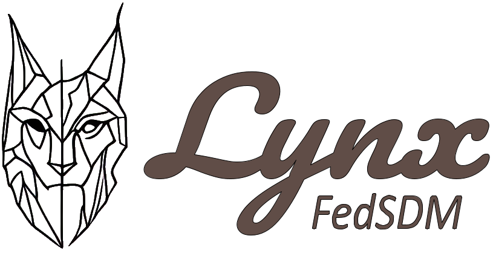

[](https://github.com/SDM-TIB/Dashboard-SDM-Federation/actions/workflows/build.yml)
[](LICENSE)


# 

Lynx FedSDM is a semantic data manager for federations of RDF datasets.
It offers features to manage federations, like adding, editing, and removing datasets.
Statistics and plots about the federations, datasets, and metadata are also provided.
Additionally, FedSDM provides the functionality of executing SPARQL queries over a federation. 
FedSDM uses [DeTrusty](https://github.com/SDM-TIB/DeTrusty) as its federated query engine.

## Running the Example
**Prerequisites:**
* make 4.1 or newer
* Docker 24.0 or newer

You might want to activate a virtual environment before proceeding, so that the build dependencies are not messing with your main installation of Python.

To start the dashboard with some preloaded example data, run
```bash
make run-example
```

The application is then accessible via your Web browser at `http://localhost:5003`.
You can stop the containers and clean up by executing the following command:
```bash
make stop-example
```

## Building from Source
**Prerequisites:**
* make 4.1 or newer
* Python3 (including pip) 3.10 or newer
* npm 7.0 or newer
* Docker 20.10 or newer
* docker-compose 1.25 or newer

If you do not change the JavaScript dependencies of the application, you can build a new Docker image by running
```bash
make rebuild
```

If you changed the JavaScript dependencies, you need to re-bundle the assets in order to use the updated libraries.
```bash
make build
```